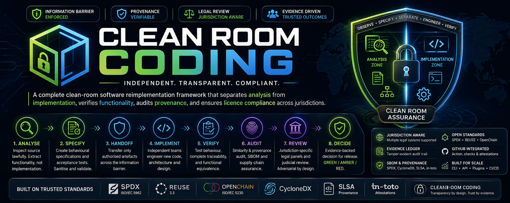

# Clean Room Coding



[](https://github.com/khhvmc5g6f-eng/clean-room-coding/actions/workflows/ci.yml)
[](LICENSE)
[](pyproject.toml)
[](REUSE.toml)

A reproducible, auditable methodology and toolchain for independently
reimplementing software functionality while managing copyright, open-source
licensing, provenance, jurisdiction and evidential integrity.

**Clean Room Coding is not "change enough code and the licence disappears,"**
and it isn't a tool that reads licensed source and mechanically rewrites it
into a new language either — that would still be a derivative of what it
read, language-hop or not. It is: lawfully observe and specify permissible
functionality, isolate source analysis from implementation, independently
engineer the replacement (in whatever language you choose — never the
reference's own source, translated), verify behaviour, audit provenance
and similarity, resolve applicable jurisdictions, conduct adversarial
review, and preserve the evidence demonstrating how the result was created.

> **This project is not a law firm and does not provide legal advice.**
> Every "legal" or "judicial" output in this repository is an AI-generated
> heuristic for engineering triage, clearly labelled as a simulation, and
> is not a substitute for qualified professional legal advice. See
> [docs/legal-disclaimer.md](docs/legal-disclaimer.md).

## Status

v0.1.0 — early, narrow-but-real core, since reviewed and hardened by an
independent code review and security audit (see
[ROADMAP.md](ROADMAP.md#external-review-findings-2026-08-22) for exactly
what was found and fixed). ROADMAP.md is the source of truth for what's
fully implemented, what is a documented limitation, and what is not yet
built. Currently ships:

- A full three-zone (Reference / Handoff / Implementation) project model
  with an allow-list-capable `PathGuard` and an append-only, hash-chained
  evidence ledger that degrades gracefully rather than crashing on a
  corrupted/interrupted write.
- Deterministic licence discovery (LICENSE/NOTICE files, SPDX headers,
  package manifests, with symlink/non-regular-file safety) plus policy
  packs for MIT, Apache-2.0, GPL-3.0-only, AGPL-3.0-only and BUSL-1.1
  (this project's own licence).
- A jurisdiction resolution engine with real, independently fact-checked
  packs for England & Wales, US federal, EU, France, Germany and Japan
  (facts + primary authorities + structured questions, not legal
  conclusions).
- A sanitisation scanner, requirement/behavioural specification graph,
  cryptographically hashed handoff manifest, and a similarity engine
  (lexical + Python AST / real tree-sitter structural via `ast-grep-py`
  for JS/TS/Go/Rust/Java/Ruby/C/C++ + negative-control background
  comparison) now wired to a real `cleanroom similarity` command.
- SBOM generation (SPDX + CycloneDX), and a heuristic legal-issue engine
  with adversarial-counsel and judicial-review **prompt generation** (the
  reasoning itself is performed by whatever LLM harness you run it through
  — this library never calls one on its own).
- A **remediation feedback loop** (`cleanroom remediate`): a RED legal
  finding or a suspicious/material similarity finding is automatically
  routed back to the implementation team as a blocked requirement, and
  `cleanroom release` refuses to proceed while one is open — closing the
  loop from "something looks wrong" to "it has to be fixed or explicitly
  signed off before this ships."
- Optional **AI-model suggestion** (`cleanroom ai-suggest`): asks
  explicitly whether to add AI/ML capability, then searches the real
  Hugging Face Hub, classifying candidates as embeddable/standalone vs.
  requiring a dedicated inference server, and checks each model's licence
  against your own policy.
- A **rich final report** — `cleanroom report --html --pdf` produces a
  colour-coded HTML page and a paginated PDF (alongside the always-written
  JSON/Markdown) covering what the project started with, what it did,
  functional coverage, remediation status, and the jurisdiction-by-
  jurisdiction decision.
- A 27-command CLI (`cleanroom ...`) with `--json` output, an actually-wired
  `--config` override, and documented exit codes for CI/CD.
- An Agent Skill at [skills/clean-room-coding/SKILL.md](skills/clean-room-coding/SKILL.md)
  for use from Claude Code.

## How this compares

A competitive-landscape review (2026-08-22) found no existing tool that
combines process-separation (reference/handoff/implementation zones, an
evidence ledger, jurisdiction resolution) with licence/similarity/SBOM
tooling the way this project does — see
[ROADMAP.md](ROADMAP.md#competitive-landscape-researched-2026-08-22) for
the full write-up. Since then, `license-expression`, `ast-grep-py`
(tree-sitter) and `spdx-tools`/`cyclonedx-python-lib` have all been
integrated in place of earlier hand-rolled logic; ScanCode Toolkit
remains a possible future optional extra for deeper licence-text
detection.

## Quick start

```bash
pip install -e ".[dev]"
cleanroom init --name "My Reimplementation Project" --target-language python
cleanroom doctor
```

See [docs/quickstart.md](docs/quickstart.md) for a full worked walkthrough
and [docs/concepts.md](docs/concepts.md) for the three-zone model,
contamination levels and clean-room maturity levels (CR0-CR5).

## Repository layout

```
clean-room-coding/
├── src/cleanroom/       # the Python engine + CLI
├── schemas/             # JSON Schemas: the contracts everything else is validated against
├── policies/licences/   # licence policy packs (facts + structured questions, not verdicts)
├── jurisdictions/       # jurisdiction packs (facts + primary authorities + structured questions)
├── prompts/             # role prompts for analyst/sanitisation/legal/judicial panels
├── skills/clean-room-coding/  # the Agent Skill (progressive disclosure)
├── docs/                # concepts, architecture, ADRs, legal disclaimer
├── examples/            # a full worked walkthrough
├── tests/               # unit + integration tests, including the framework's own self-tests
├── integrations/github-action/  # reusable GitHub Action
└── .github/              # CI, issue templates, CODEOWNERS
```

## Contributing

See [CONTRIBUTING.md](CONTRIBUTING.md) and [GOVERNANCE.md](GOVERNANCE.md).
Security issues: see [SECURITY.md](SECURITY.md).

## Licence

[Business Source License 1.1](LICENSE) (BUSL-1.1) — source-available, not
OSI-approved. Free to use, modify, self-host and run commercially
in-house; you may not resell it, white-label it, or offer it to others as
a hosted/SaaS product in competition with the Licensor. Converts to
GPL-3.0-or-later on 2030-08-22. See [LICENSE](LICENSE) for the full terms
(including the Additional Use Grant) and [NOTICE](NOTICE) for a summary.
This project practises the provenance standards it promotes — see its own
[SBOM](evidence/) and [REUSE](REUSE.toml) configuration.
